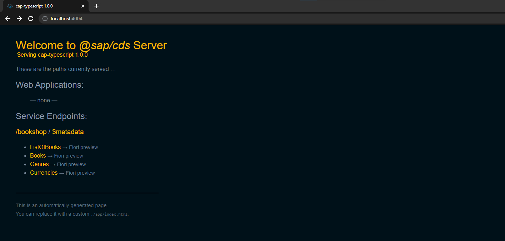
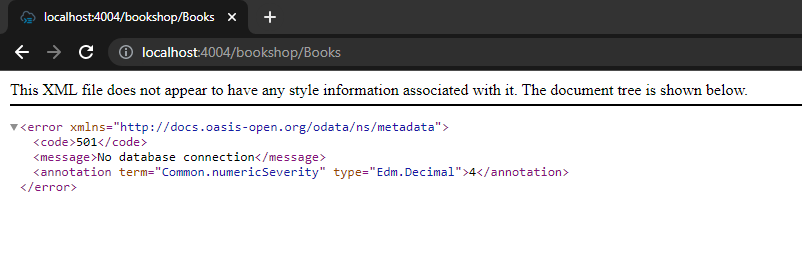
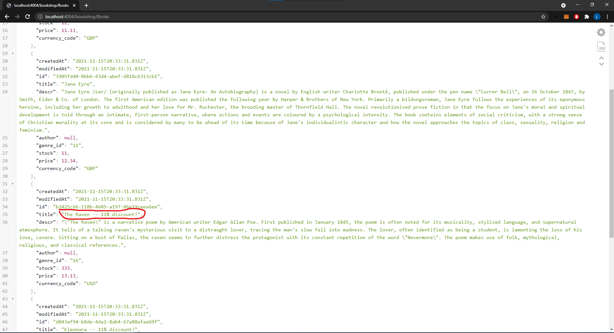

No post de hoje iremos mostrar um pouco como trabalhamos aqui na VAAES.

Muitos de vocês nunca ouviram falar ou não sabem quais ferramentas de desenvolvimento a SAP nos disponibiliza para desenvolvimento de aplicações, então resolvi trazer hoje um pouco sobre Cloud Application Programming Model ou CAP para os íntimos.

CAP é uma ferramenta que utilizamos para desenvolver API's de maneira simples e prática. Ele não está disponível somente em Java, mas também de NodeJs e todos sabemos como NodeJs é muito comum no desenvolvimento cloud. Trabalhar com Javascript no backend é sensacional, porém à medida que os projetos ficam maiores, a tipagem fraca do Javascript pode ser desafiadora. Então, o Typescript entra na jogada para nos fornecer tipagem mais robusta. E confesso que sou fã dessa tecnologia.

Aqui podemos ver a estrutura de pastas de um projeto normal CAP. Perceba que os arquivos `.cds` e `.js` ficam misturados dentro da pasta srv. Infelizmente não podemos movê-los para diferentes pois o CAP não consegue reconhecê-los.


Estrutura do projeto

Além disso, os arquivos de `handlers` em Javascript acabavam realizando todas as lógicas num só lugar. Desde buscar o dado no banco de dados, regras de negócio, etc. E isso não é tão legal para manutenção de código. Como podemos ver no exemplo abaixo:


Código em javascript


Código em javascript

## Code

Sem mais enrolação, vamos ao que interessa. Iremos criar o famoso exemplo de livraria proposto pela SAP - O bookshop.

>Nota: Este tutorial foi feito com NodeJs v14.17.6 e @sap/cds 5.4.3


Primeiramente, vamos criar uma pasta para nosso novo projeto:


Agora, vamos instalar globalmente a biblioteca de linha de comando do CAP:

```bash
npm i -g @sap/cds-dk hana-cli
```


Feito isso, vamos criar o esqueleto do projeto:
```bash
cds init
```


Agora, vamos criar o modulo db. Este comando irá criar os arquivos necessários para o módulo db rodar corretamente:
```bash
hana-cli createModule
```


Com o módulo db pronto, vamos criar nosso arquivo cds dentro do módulo db onde criaremos as entidades da nossa livraria posteriormente:
```bash
cd db && mkdir cds && cd cds && touch bookshop.cds
```

Agora, vamos preencher o arquivo `bookshop.cds` com as entidades:
```typescript
using {
    Currency,
    managed,
    sap
} from '@sap/cds/common';

namespace bookshop;

entity Books: managed {
    key id: UUID;
        title: localized String(111);
        descr: localized String(1111);
        author: Association to Authors;
        genre: Association to Genres;
        stock: Integer;
        price: Decimal;
        currency: Currency;
        image: LargeBinary @Core.MediaType: 'image/png';
}

entity Authors: managed {
    key id: UUID;
        name: String(111);
        dateOfBirth: Date;
        dateOfDeath: Date;
        placeOfBirth: String;
        placeOfDeath: String;
        books: Association to many Books on books.author = $self;
}

entity Genres: sap.common.CodeList {
    key id: UUID;
        parent: Association to Genres;
        children: Composition of many Genres on children.parent = $self;
}
```

>Nota: Para saber mais a respeito dos arquivos cds, visite esta [página](https://cap.cloud.sap/docs/)

Vamos criar o serviço para expor nossas entidades:
```bash
 cd ../../srv/ && touch bookshop.cds
```

Preencha o conteúdo do arquivo criado com:
```typescript
using {bookshop} from '../db/cds/bookshop';

service BookshopService {
    @readonly
    entity ListOfBooks as projection on Books excluding {
        descr
    };

    @readonly
    entity Books as projection on bookshop.Books {
        * ,
        author.name as author
    } excluding {
        createdBy,
        modifiedBy
    };
}
```

Rodando o serviço:
```bash
cd .. && cds run
```


Nosso serviço foi exposto na porta 4004 (padrão):



Porém, ao tentarmos acessar alguma das entidades expostas, perceba que ocorrerá um erro. Isto ocorre porque ainda não instalamos o banco de dados para rodar nossa aplicação.




Agora que temos nossa modelagem e o serviço prontos, vamos adicionar algumas dependências para que consigamos rodar nossa aplicação corretamente:

```bash
# Production dependencies
npm i @sap/cds @sap/hana-client @sap/xsenv @sap/xssec cds-routing-handlers express npm-run-all passport reflect-metadata module-alias

# Dev dependencies
npm i -D @types/express @typescript-eslint/eslint-plugin @typescript-eslint/parser cds2types eslint eslint-config-google eslint-plugin-prettier git-commit-msg-linter jest nodemon prettier sqlite3 supertest typescript @types/jest ts-jest
```

Explicando as dependencias:
```bash
1) @sap/cds - linha de comando para que qualquer um consiga rodar o projeto sem precisar instalar o cds globalmente
2) @sap/hana-client - biblioteca utilizada para conectar ao banco hana da SAP (utilizada somente em ambiente produtivo)
3) @sap/xsenv - utilizada para buscar variáveis de ambiente dentro do container deployado no Cloud Foundry (Cloud platform da SAP)
4) @sap/xssec e passport - Responsáveis pela segurança da aplicação
5) cds-routing-handlers e express - Framework para expor nossa API e redirecionar nossos custom handlers para onde quisermos
6) reflect-metadata - Utilizada para vários propósitos, mas  no nosso projeto será utilizada para emitir dados de decorators
7) module-alias - Como utilizaremos typescript, este módulo nos permite cadastrar atalhos para acessarmos as pastas dentro do nosso código typescript. Além disso, a transpilação permite o código continuar funcionando em javascript.
```

Após a instalação das dependências, vamos criar mais duas pastas na raíz do projeto:

```
mkdir src && mkdir scripts
```

Vamos adicionar alguns arquivos responsáveis pela configuração do nosso ambiente de desenvolvimento:

.cdsrc.json
```JSON
{
    "build": {
        "target": "gen"
    },
    "hana": {
        "deploy-format": "hdbtable"
    },
    "[production]": {
        "requires": {
            "db": {
                "kind": "hana"
            },
            "uaa": {
                "kind": "xsuaa"
            }
        }
    },
    "requires": {
        "db": {
            "kind": "sqlite"
        }
    }
}
```

.eslintignore
```JSON
gen/
node_modules/
coverage/
**/*.cds
```

.eslintrc.json
```JSON
{
    "env": {
        "browser": true,
        "commonjs": true,
        "es6": true
    },
    "parser": "@typescript-eslint/parser",
    "plugins": [
        "@typescript-eslint",
        "prettier"
    ],
    "extends": [
        "google"
    ],
    "globals": {
        "Atomics": "readonly",
        "SharedArrayBuffer": "readonly"
    },
    "parserOptions": {
        "ecmaVersion": 2020
    },
    "rules": {
        "prettier/prettier": [ "error", { "endOfLine": "auto" } ],
        "@typescript-eslint/no-unused-vars": ["error", { "caughtErrors": "all", "caughtErrorsIgnorePattern": "^ignore", "ignoreRestSiblings": true }],
        "arrow-parens": "off",
        "camelcase": "off",
        "comma-dangle": "off",
        "indent": ["error", 4, { "SwitchCase": 1 }],
        "linebreak-style": "off",
        "max-len": ["error", 120],
        "max-lines-per-function": ["warn", 30],
        "new-cap": "off",
        "no-tabs": ["error"],
        "object-curly-spacing": ["error", "always"],
        "operator-linebreak": "off",
        "prefer-rest-params": "off",
        "quote-props": ["error", "as-needed"],
        "require-jsdoc": "off",
        "space-before-function-paren": "off",
        "valid-jsdoc": "off"
    }
}
```

.gitignore
```bash
gen/
sqlite.db
coverage
*.lcov
node_modules/
```

.prettierignore
```bash
**/*.cds
```

.prettierrc.json
```JSON
{
    "trailingComma": "es5",
    "tabWidth": 4,
    "semicolons": true,
    "ternaries": false,
    "printWidth": 120,
    "singleQuote": true
}
```

nodemon.json
```JSON
{
    "watch": ["src/**/*", "srv/**/*"],
    "ignore": "./src/entities/",
    "ext": "csv,cds,ts",
    "exec": "npm run build:local && node ./gen/srv/srv/server.js",
    "env": {
        "PORT": 4004,
        "NODE_ENV": "development"
    }
}
```

tsconfig.json
```JSON
{
    "compilerOptions": {
        "lib": ["ES2019"],
        "module": "commonjs",
        "target": "ES2019",
        "esModuleInterop": true,
        "inlineSourceMap": true,
        "inlineSources": true,
        "outDir": "./gen/srv/srv",
        "emitDecoratorMetadata": true,
        "experimentalDecorators": true,
        "preserveConstEnums": true,
        "skipLibCheck": true,
        "baseUrl": ".",
        "paths": {
            "@/*": ["src/*"]
        }
    },
    "include": ["src"],
    "exclude": ["node_modules"]
}
```

jest-integration.config.js
```javascript
const config = require('./jest.config');
config.testMatch = ['**/*.test.ts'];
module.exports = config;
```

jest-unit.config.js
```javascript
const config = require('./jest.config');
config.testMatch = ['**/*.spec.js'];
module.exports = config;
```

jest.config.js
```javascript
const { pathsToModuleNameMapper } = require('ts-jest/utils');
const { paths } = require('./tsconfig').compilerOptions;

module.exports = {
    globals: {
        'ts-jest': {
            diagnostics: false,
        },
    },
    roots: ['<rootDir>/tests', '<rootDir>/srv'],
    collectCoverageFrom: ['<rootDir>/srv/**/*.js'],
    coverageDirectory: 'coverage',
    coverageProvider: 'babel',
    testEnvironment: 'node',
    transform: {
        '.+\\.ts$': 'ts-jest',
    },
    moduleNameMapper: {
        ...pathsToModuleNameMapper(paths, { prefix: '<rootDir>' }),
    },
};
```

Agora, vamos criar os scripts no nosso package.json:
```JSON
"scripts": {
    "start": "CDS_ENV=production NODE_ENV=production cds run",
    "dev": "nodemon",
    "build": "mbt build",
    "build:local": "npm-run-all build:db-local build:cds build:ts",
    "build:cds": "node ./scripts/convert-entities-to-ts",
    "build:ts": "tsc",
    "build:db-local": "cds deploy --to sqlite:sqlite.db --no-save --with-mocks",
    "eslint:ci": "eslint --fix src",
    "test": "jest --passWithNoTests --silent --runInBand",
    "test:unit": "npm test -- --watchAll -c jest-unit.config.js",
    "test:integration": "npm test -- --watchAll -c jest-integration.config.js",
    "test:staged": "npm test -- --findRelatedTests",
    "test:ci": "npm test -- --coverage"
}
```

Agora que criamos os scripts no package.json, vamos criar um script para converter as entidades do cds para ts. Este script é necessário pois a biblioteca cds2types possui algumas limitações e uma delas é não conseguir converter `actions` e `functions` customizadas
```bash
cd scripts && touch convert-entities-to-ts.js
```

E vamos colocar a lógica para executar a lib de convertão de cds para typescript
```javascript
const { readdirSync, existsSync, mkdirSync } = require('fs');
const { resolve } = require('path');
const { execSync } = require('child_process');

const files = readdirSync(resolve(__dirname, '..', 'srv')).filter((file) => file.includes('.cds'));

if (!existsSync(resolve(__dirname, '..', 'src', 'entities'))) {
    mkdirSync(resolve(__dirname, '..', 'src', 'entities'));
}

for (const file of files) {
    const srvPath = resolve(__dirname, '..', 'srv');
    const srcPath = resolve(__dirname, '..', 'src');
    const cdsToConvert = `--cds ${srvPath}/${file}`;
    const fileWithoutExtension = file.split('.')[0];
    const outputFile = `--output ${srcPath}/entities/${fileWithoutExtension}.ts`;
    execSync(`npx cds2types ${cdsToConvert} ${outputFile} -f`);
}

execSync('cds build && cp .cdsrc.json gen/srv');
```

Agora vamos criar nosso primeiro custom handler. Este handler de exemplo, alterará o título de cada livro antes de exibir para o usuário final.

Eu gosto de separar em services quando a lógica será aplicada diretamente no serviço principal e handlers quando trabalhamos com actions e functions. Veremos um exemplo em alguns instantes.

```bash
mkdir src/services && cd "$_" && touch bookshop.ts
```

E adicione o conteúdo do serviço
```typescript
import { Handler, AfterRead, Entities } from 'cds-routing-handlers';
import { BookshopService } from '@/entities/bookshop';

@Handler(BookshopService.SanitizedEntity.Books)
export class BookService {
    @AfterRead()
    public async addDiscount(@Entities() books: BookshopService.Books[]): Promise<void> {
        books = !Array.isArray(books) ? [books] : books;
        for (const book of books) {
            if (book.stock > 111) {
                book.title += ` -- 11% discount!`;
            }
        }
    }
}
```

Perceba que o typescript implicará com o import do nosso serviço, pois está apontando para uma pasta que não existe. Para isso precisamos fazer duas coisas

Criar um arquivo de configuração para aceitar o `@` como um mapeamento de paths válido
```bash
mkdir src/config && cd "$_" && touch module-alias.ts
```

```typescript
import { join } from 'path';
import moduleAlias from 'module-alias';

moduleAlias.addAlias('@', join(__dirname, '..'));
```

E precisamos rodar o script que criamos agora a pouco no nosso package.json
```bash
npm run build:local
```

Este script criará pra gente a pasta entities e dentro dela serão criadas as entidades que a gente expos anteriormente nos arquivos cds.

Agora, precisamos apenas criar o server para que consigamos apontar estes serviços e handlers customizados para nosso código typescript

```bash
cd src && touch server.ts && touch app.ts
```

app.ts
```typescript
import 'reflect-metadata';
import './config/module-alias';
import express from 'express';
import { createCombinedHandler } from 'cds-routing-handlers';
import cds from '@sap/cds';

export const application = async () => {
    const app = express();

    const hdl = createCombinedHandler({
        handler: [__dirname + '/services/**/*.js', __dirname + '/handlers/**/*.js'],
    });

    await cds.connect('db');
    await cds
        .serve('all')
        .in(app)
        .with((srv) => hdl(srv));

    return app;
};
```

server.ts
```typescript
import { application } from './app';

export class Server {
    public static async run() {
        const app = await application();
        const port = process.env.PORT || 3001;
        app.listen(port, async () => {
            console.info(`Server is listing at http://localhost:${port}`);
        });
    }
}

Server.run();
```

Pronto!
Nossa API já pode ser consumida com custom handlers e services escritos em typescript!

Você pode alimentar este banco de dados criando arquivos csv dentro da pasta db/data. Você pode encontrar um exemplo [aqui](https://github.com/mlucascardoso/cap-typescript/tree/main/db/data)

Após alimentar o banco de dados, inicie a API com o comando `npm run dev` e acesse [localhost](http://localhost:4004/bookshop/Books)

Perceba que nossa lógica customizada já está funcionando



## Custom action

Agora que já vimos como criar um serviço customizado, vamos ver como ficaria uma action customizada

```bash
mkdir -p src/handlers/actions && cd "$_" && touch submit-order.ts
```

Vamos editar nosso arquivo bookshop cds dentro de srv

srv/bookshop.cds
```typescript
    action submitOrder(book: Books:id, quantity: Integer) returns {
        stock: Integer
    };
```

src/handlers/actions/submit-order.ts
```typescript
import cds from '@sap/cds';
import { Action, Handler, Param, Req } from 'cds-routing-handlers';
import { BookshopService, bookshop } from '@/entities/bookshop';
import { Request } from '@sap/cds/apis/services';

@Handler()
export class SubmitOrderHandler {
    @Action(BookshopService.ActionSubmitOrder.name)
    public async handle(
        @Param(BookshopService.ActionSubmitOrder.paramBook) bookId: bookshop.Books['id'],
        @Param(BookshopService.ActionSubmitOrder.paramQuantity) quantity: number,
        @Req() req: Request
    ): Promise<any> {
        if (!bookId || !quantity) {
            return req.reject(400, 'Please, provide all mandatory fields');
        }

        const affectedRows = await cds
            .update(BookshopService.Entity.Books)
            .with({ stock: { '-=': quantity } })
            .where({ id: bookId, stock: { '>=': quantity } });

        if (affectedRows < 0) {
            return req.reject(409, `${quantity} exceeds stock for book ${bookId}`);
        }
    }
}
```

Perceba como o código fica bem isolado e de fácil entendimento. Vamos testar!

```bash
mkdir tests/http && cd "$_" && touch submit-order.http
```

```http
### Requires REST Client for VS Code
### https://marketplace.visualstudio.com/items?itemName=humao.rest-client
###

@host = http://localhost:4004

### Submit order
POST {{host}}/bookshop/submitOrder
Accept: application/json
Content-Type: application/json

{ 
  "book": "88d439f1-6b88-4f04-a900-381b836dfa51",
  "quantity": 10 
}

### Read Books
GET {{host}}/bookshop/Books(88d439f1-6b88-4f04-a900-381b836dfa51)
```


## Testing

Para realizar os testes da nossa aplicação, já deixamos previamente configurado jest. É um framework de testes bem famoso e de fácil entendimento

Vamos criar um teste de exemplo que vai consumir nossa API real e verificar se está tudo certo
```bash
mkdir tests/integration && cd "$_" && touch bookshop.test.ts
```

bookshop.test.ts
```typescript
import supertest from 'supertest';
import { application } from '../../src/app';

let app = null;

describe('Books', () => {
    beforeAll(async () => {
        app = await application();
    });

    it('should return 200 if books were listed correctly', async () => {
        const api = supertest(app) as any;
        const response = await api.get('/bookshop/Books');
        expect(response.statusCode).toEqual(200);
    });

    afterEach((done) => {
        done();
    });
});
```

Lembra que a gente configurou o app.ts separado do servidor? Aquela configuração foi proposital, pois conseguimos utilizar a mesma configuração para nossos testes :)

Rodando os testes
```bash
npm run test:integration
```

Se você criar testes unitários, também é possível. Basta criar o arquivo com o seguinte padrão `<filename>.unit.ts` e rodar os testes com `npm run test:unit`